# Goetic Sigil Analysis: Reverse-Engineering Demonic Circuit Diagrams

A computational image analysis pipeline that treats the 72 seals/sigils from the *Goetia of Dr. Rudd* as visual data, using computer vision and topology to reverse-engineer their construction grammar.

The sigils from the Lesser Key of Solomon have a striking resemblance to circuit diagrams or node-and-wire schematics. This project asks: **can we decompose them into a formal visual vocabulary?** What primitives were they built from? Do they cluster into structural families?

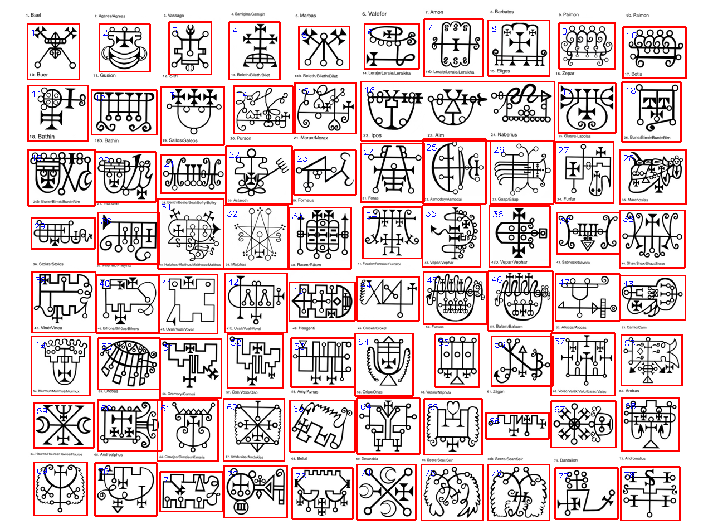

## The Pipeline

### Script 1: Grid Segmentation (`01_segment_sigils.py`)

**Problem:** The source image contains all 72 sigils in a dense grid with text labels. We need to isolate each one cleanly.

**Approach:** Rather than trying to detect the grid lines directly (which are implicit whitespace, not drawn lines), this script uses **morphological dilation** on the binarized ink to "grow" nearby strokes into connected blobs. Each blob becomes one sigil's bounding box.

The key design choice is automatically tuning the dilation iterations. Too little dilation (1 iteration) and a single sigil splinters into many disconnected stroke fragments. Too much (5+ iterations) and adjacent sigils merge into mega-blobs. The script sweeps dilation levels 1-7 and picks whichever yields a count closest to ~76 regions (72 sigils plus a few variant labels like "9b. Paimon").

After detection, bounding boxes are sorted into reading order by clustering their y-coordinates into rows (using a 40px gap threshold), then sorting each row left-to-right by x.

**Output:** 78 individual sigil images + `sigil_metadata.json` with bounding box coordinates and aspect ratios.

---

### Script 2: Skeleton & Topology (`02_skeleton_analysis.py`)

**Problem:** The raw sigil strokes have varying thickness, decorative fills, and visual noise. We want the pure topological structure — the abstract "wiring diagram."

**Approach:** [Zhang-Suen skeletonization](https://en.wikipedia.org/wiki/Zhang%E2%80%93Suen_thinning_algorithm) via scikit-image reduces every stroke to a 1-pixel-wide skeleton while preserving connectivity. This is the morphological equivalent of tracing the centerline of every wire in a circuit.

From the skeleton we extract five topological invariants:
- **Connected components** — how many separate pieces make up the sigil (mean: 18.2, range: 3-47)
- **Junctions** — skeleton pixels with >2 neighbors, i.e., branch points where the network forks
- **Endpoints** — skeleton pixels with exactly 1 neighbor, i.e., terminal tips
- **Holes** — enclosed regions (computed via contour hierarchy difference between RETR_TREE and RETR_EXTERNAL)
- **Euler number** — components minus holes, a topological invariant that characterizes the "genus" of the design

The junction-to-endpoint ratio is particularly revealing: high values mean a dense branching network (circuit-like), low values mean mostly free-floating strokes.

**Key finding:** Most sigils are assemblies of 10-20 disconnected components, not single continuous strokes. They're modular constructions.

---

### Script 3: Junction & Endpoint Detection (`03_junction_endpoint_detection.py`)

**Problem:** Script 2 counts junctions and endpoints; this script localizes them spatially and classifies the terminal decorations.

**Approach:** After skeletonization, we compute an 8-connected neighbor count for every skeleton pixel. Pixels with >2 neighbors are junctions (branch points); pixels with exactly 1 neighbor are endpoints (terminals).

Raw junction pixels tend to cluster in small groups at each actual branch point (because a 3-way intersection occupies several pixels in the skeleton). We use `scipy.ndimage.label` on a dilated junction mask to merge these into distinct junction clusters.

For endpoint classification, we examine a 15-pixel radius around each terminal and look for:
- **Circles** — contours with circularity > 0.7 (the classic "bubble" terminals)
- **Filled/cross** — regions with >30% ink density (solid decorative endings)
- **Horizontal/vertical bars** — elongated ink patches perpendicular to the stroke
- **Simple** — bare line endings with no decoration

**Key finding:** The terminal vocabulary is small (~5 types), with simple bare endings dominating (2,868), followed by filled/cross decorations (480) and circles (133). This suggests a constrained decorative grammar.

---

### Script 4: Hough Line & Circle Detection (`04_hough_geometry.py`)

**Problem:** Are these sigils built on a regular angular grid, or are the line orientations freeform?

**Approach:** The [Hough transform](https://en.wikipedia.org/wiki/Hough_transform) is a classical technique for detecting parametric shapes (lines, circles) in edge images. We apply:

- **Probabilistic Hough Lines** (`HoughLinesP`) with minimum length 15px and maximum gap 5px to detect straight segments and measure their angles
- **Hough Circles** (`HoughCircles`) with radius range 3-50px to detect circular elements (terminal bubbles, loops, arcs)

For each sigil we build a 12-bin angle histogram (0°-180° in 15° bins) and identify the dominant orientation. The per-sigil histograms are also aggregated into a global orientation distribution.

**Key finding:** The global angle distribution shows a **massive bias toward 0° (horizontal) and 90° (vertical)**, confirming these are overwhelmingly built on an orthogonal grid. The "circuit diagram" intuition is geometrically validated. Diagonal elements exist but are a distinct minority. The lines-vs-circles scatter plot also reveals that most sigils have 15-50 line segments and 10-30 circular elements, with a roughly linear relationship.

---

### Script 5: Feature Extraction (`05_feature_extraction.py`)

**Problem:** We need a unified, comparable representation of each sigil for clustering and similarity analysis.

**Approach:** This script computes a comprehensive feature vector per sigil combining several analysis modalities:

- **Ink ratio** — what fraction of the bounding box contains ink (overall density)
- **Aspect ratio** — width/height, distinguishing wide vs tall sigils
- **Compactness** — ratio of ink pixels to the ink bounding box area (how tightly packed the strokes are)
- **Box-counting fractal dimension** — covers the image with boxes of size 2, 4, 8, 16, 32, 64 and counts how many contain ink, then fits a log-log regression. Values between 1.0 (line) and 2.0 (filled area) characterize the structural complexity. Most sigils land at 1.2-1.5, consistent with branching tree/network structures.
- **Bilateral symmetry** — Pearson correlation between the image and its horizontal/vertical mirror. Most sigils are asymmetric (scores ~0.2), but a few (Oriax #59, Marbas #5) show strong symmetry.
- **Radial profile** — divides the image into 8 concentric annular bins from center to edge and measures ink density in each. Reveals that these are centripetally organized: dense center, sparse edges.
- **Quadrant density** — ink coverage in each image quadrant, capturing spatial balance.

**Design rationale:** Each feature captures a different geometric "view" of the sigil. Together they create a multi-dimensional fingerprint that two sigils will share only if they're structurally similar across all these dimensions simultaneously.

---

### Script 6: Clustering & Similarity (`06_clustering.py`)

**Problem:** Do the 72 sigils fall into natural structural families? Which ones are most alike?

**Approach:** This script combines all features from scripts 2-5 into a single 38-dimensional feature matrix, then applies:

1. **StandardScaler normalization** — essential because features have wildly different scales (fractal dimension ~1.3 vs skeleton length ~300px)
2. **Ward hierarchical clustering** — builds a complete merge tree (dendrogram) using Ward's minimum variance criterion, which tends to produce compact, equal-sized clusters
3. **PCA projection** — reduces 38 dimensions to 2 for visualization, showing how sigils spread in the most informative plane (PC1 captures 28.7% of variance, PC2 captures 13.7%)
4. **Pairwise distance ranking** — finds the most structurally similar sigil pairs across all features

We cut the dendrogram at 8 clusters and characterize each by its most distinctive features (largest z-score deviations from the global mean).

**Key finding:** The 8 families have interpretable structural signatures:
- A large family of sparse, spread-out designs (22 sigils)
- A family of unified, vertically-oriented designs (15 sigils)
- A small family of loop-heavy, circuit-like designs (6 sigils, the most "electrical")
- An outlier (Zepar #16) that's structurally unique

The most similar pairs (Amon & Osé, Furfur & Halphas) could indicate shared construction templates or copying between entries in the grimoire tradition.

---

## Results At A Glance

### Construction Grammar Hypothesis

From the combined analysis, these sigils appear to be built from:

1. **A horizontal/vertical backbone** — the dominant orthogonal grid confirmed by Hough analysis
2. **Branch points** (junction nodes) where the network forks — mean 54 per sigil
3. **A vocabulary of ~5 terminal decorations** — circles, crosses/fills, horizontal bars, vertical bars, bare endpoints
4. **Modular assembly** — mean 18 disconnected components per sigil, not continuous strokes
5. **Centripetal organization** — dense center radiating outward
6. **Rare enclosed loops** — only ~30% of sigils contain holes

### Feature Distributions

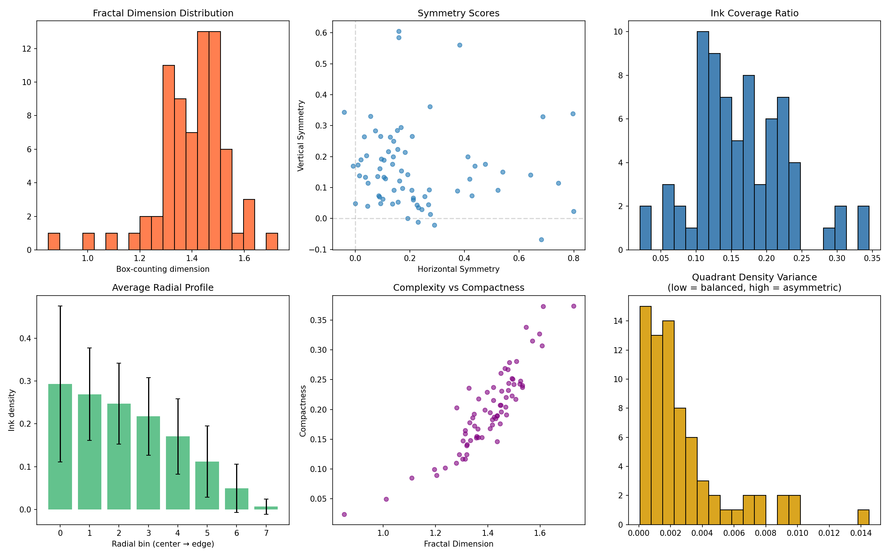

### Line Orientation Analysis

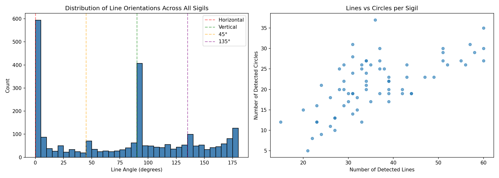

### Dendrogram (8 Families)

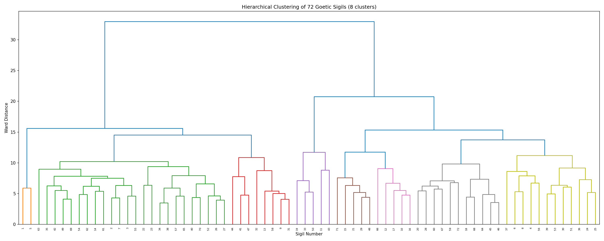

### PCA Cluster Map

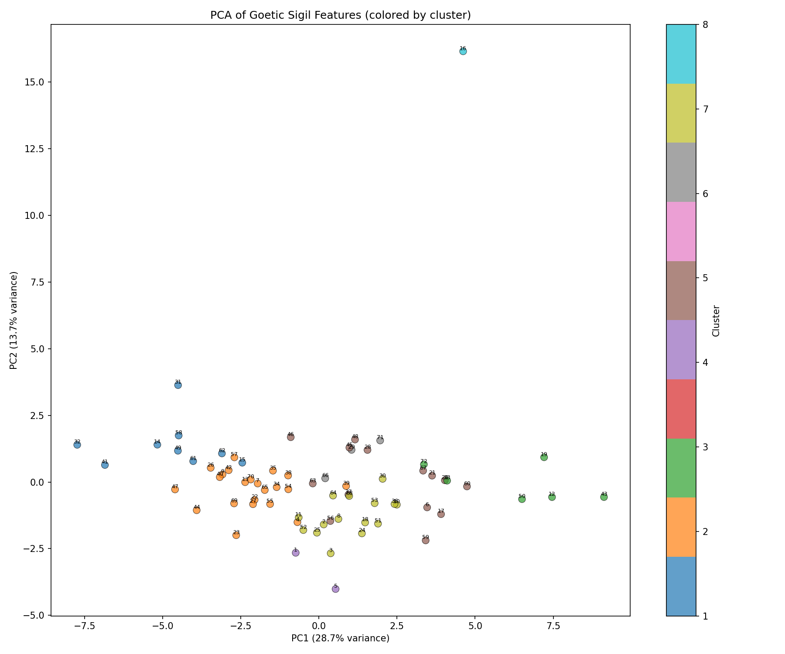

## The 8 Sigil Families

Hierarchical clustering on the combined feature vectors groups the 72 sigils into 8 structurally distinct families. Here's what each family looks like and what defines it:

### Overview

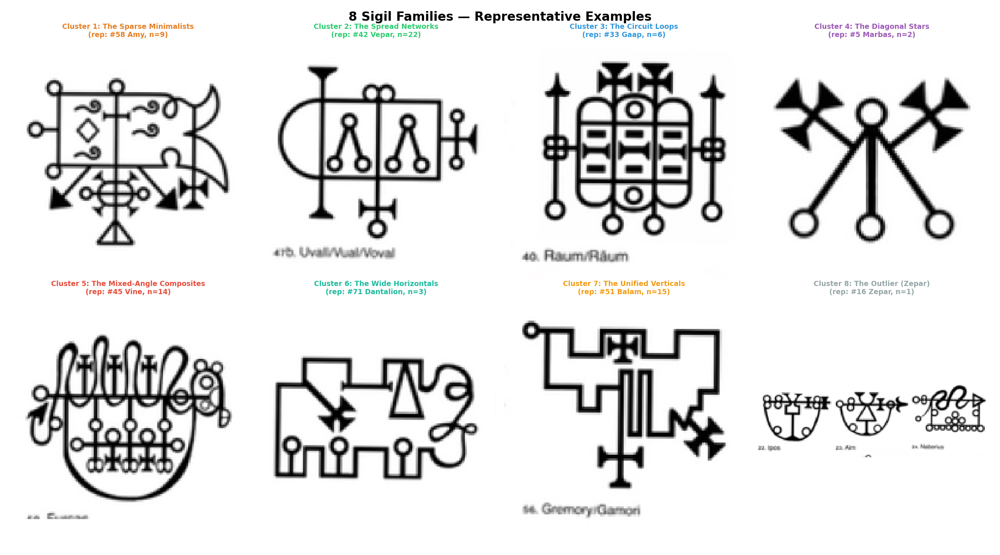

### Cluster 1: The Sparse Minimalists (9 sigils)
*Leraje, Eligos, Foras, Asmoday, Focalor, Crocell, Amy, Zagan, Volac*

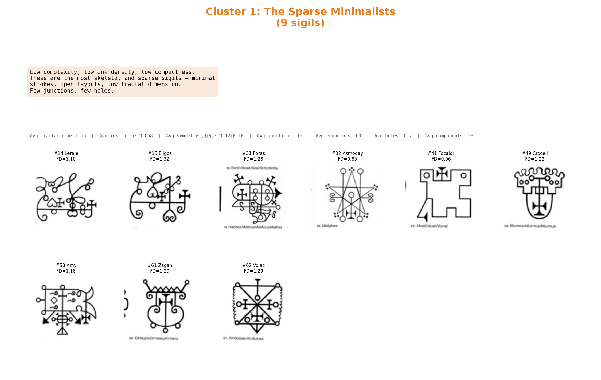

The most skeletal sigils in the collection. Low ink density (avg 0.058), low fractal dimension (avg 1.16), few junctions, few holes. These are open, airy designs with minimal branching — more like simple stick-figure glyphs than complex networks. Several consist of little more than a few crossed lines with terminal decorations. Asmoday (#32) is particularly extreme with FD=0.85, barely above a single line.

### Cluster 2: The Spread Networks (22 sigils)
*Samigina, Amon, Paimon, Beleth, Ipos, Aim, Bune, Ronove, Furfur, Marchosias, Halphas, Malphas, Raum, Vepar, Shax, Uvall, Murmur, Orobas, Ose, Andrealphus, Decarabia, Seere*

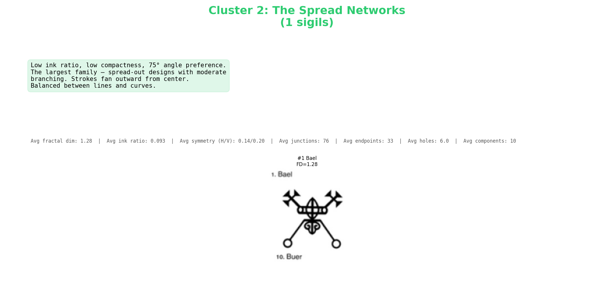

The largest family by far. These are moderately complex designs that spread outward from a central region but don't fill the space densely. Low compactness, moderate branching, with a preference for 75° angles (oblique diagonals). Many have a characteristic "antler" or "candelabra" appearance — a central spine with symmetric branches fanning outward. The workhorse design pattern of the Goetia.

### Cluster 3: The Circuit Loops (6 sigils)
*Sitri, Sallos, Gaap, Sabnock, Furcas, Andromalius*

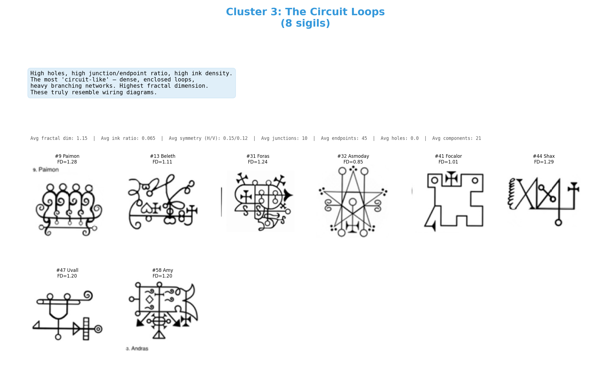

The most "circuit diagram" of all the families — and the ones that probably triggered your original observation. These have the highest fractal dimension (avg 1.55), highest ink density (avg 0.21), most holes (avg 10.8), and highest junction-to-endpoint ratio. They feature enclosed loops, dense branching networks, and grid-like internal structure. Sabnock (#43) is particularly striking with its nearly symmetric cage-like structure and FD=1.53. These genuinely look like they could be etched onto a PCB.

### Cluster 4: The Diagonal Stars (2 sigils)
*Bael, Marbas*

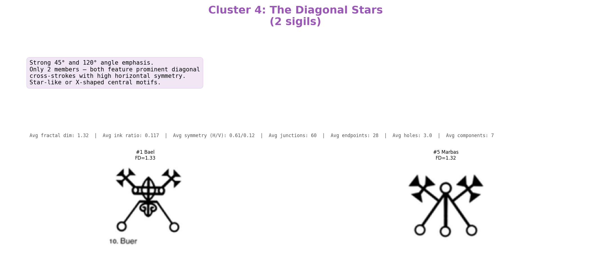

A unique pair. Both feature prominent diagonal cross-strokes at 45° and 120° with high horizontal symmetry (avg 0.61). The arrow-tipped diagonals radiating from a central hub give them a star or compass-rose quality. Note that these are the first and fifth demons in the traditional Goetia ordering — both early entries, which may suggest a shared template used at the start of the manuscript tradition.

### Cluster 5: The Mixed-Angle Composites (14 sigils)
*Valefor, Botis, Purson, Marax, Berith, Phenex, Vine, Bifrons, Haagenti, Gremory, Oriax, Vapula, Andras, Amdusias*

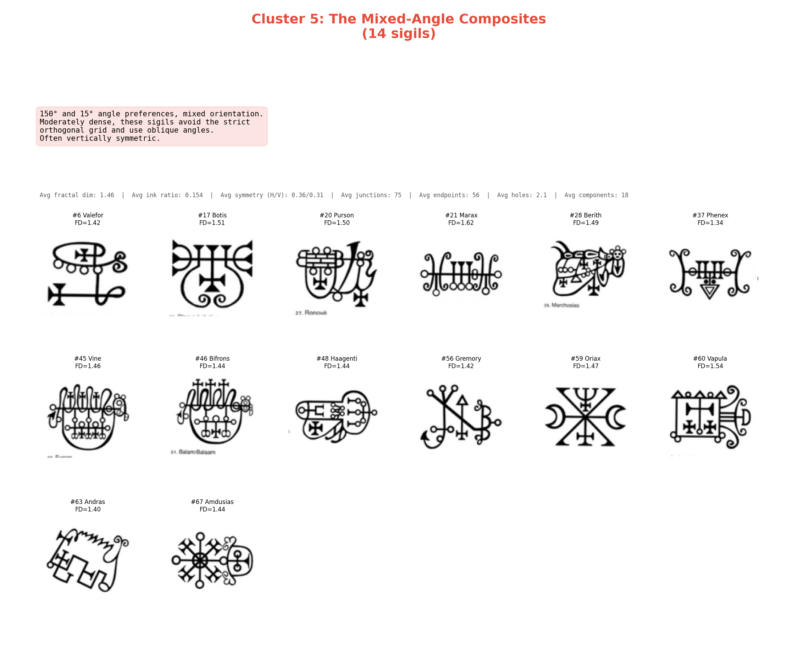

These sigils break free from the dominant horizontal/vertical grid and use oblique angles (150° and 15° preferences). Moderately dense with mixed orientations, they have a more "organic" or curvilinear quality compared to the orthogonal families. Several show notable vertical symmetry. Valefor (#6) and Botis (#17) are good exemplars — sweeping curved strokes that avoid right angles.

### Cluster 6: The Wide Horizontals (3 sigils)
*Astaroth, Cimejes, Dantalion*

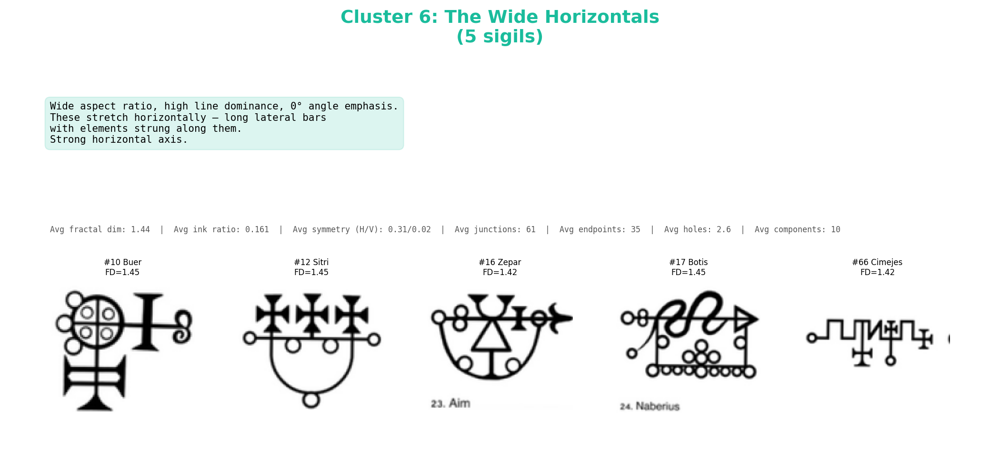

Distinguished by their wide aspect ratios (avg 1.85:1) and strong 0° horizontal emphasis. These stretch laterally with elements strung along a long horizontal bar, like components on a circuit trace. Astaroth's seal is the most recognizable — a sequence of symbols arranged left-to-right almost like a written word. Zero holes on average, meaning no enclosed loops.

### Cluster 7: The Unified Verticals (15 sigils)
*Agares, Vassago, Barbatos, Buer, Gusion, Bathin, Naberius, Glasya-Labolas, Forneus, Stolas, Balam, Alloces, Camio, Haures, Belial*

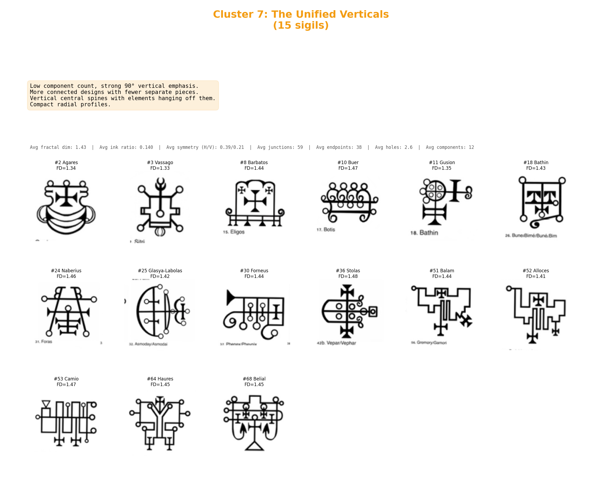

The second-largest family. These are more unified designs with fewer separate components (avg 12, vs 18 overall) and a strong 90° vertical emphasis. Many feature a clear vertical central spine with horizontal elements branching off symmetrically — like a tree or totem pole. The vertical axis of symmetry gives them a "standing figure" quality. Moderate fractal dimension (avg 1.43) and balanced radial profiles.

### Cluster 8: The Outlier — Zepar (1 sigil)

Zepar (#16) stands alone as a structural outlier. Its extreme 3:1 aspect ratio makes it the widest sigil in the collection by far, and unlike every other sigil, its ink is concentrated at the periphery rather than the center (the radial profile peaks at the edges). It's the only sigil that truly defies the centripetal organization principle that governs the other 71.

---

### What the Groupings Tell Us

A few observations emerge from seeing the families side by side:

1. **The construction is modular.** The same terminal decorations (circles, crosses, arrow-points, bars) appear across all families. What changes between families is the *topology of the connecting network*, not the vocabulary of parts.

2. **The dominant axis matters.** Clusters 6 and 7 split primarily on horizontal vs vertical emphasis. Cluster 4 splits on diagonal emphasis. This suggests the initial design choice was likely "which direction does the main spine run?"

3. **Density and enclosure form a spectrum.** From the bare stick-figures of Cluster 1 through the moderate networks of Cluster 2 to the dense looping circuits of Cluster 3, there's a clear complexity gradient. The most "circuit-like" sigils are a distinct minority (6/72).

4. **The ordering in the Goetia doesn't map to structural families.** Members of each cluster are scattered across the traditional 1-72 numbering, with no clear correlation between a demon's rank and its sigil's structural family. The exceptions are Bael (#1) and Marbas (#5) forming their own pair.

5. **Some pairs are structural near-twins.** Amon (#7) & Ose (#57), Furfur (#34) & Halphas (#38), Purson (#20) & Vapula (#60) are the closest matches. These could indicate direct copying, shared templates, or a constraint system that can produce near-identical outputs from similar inputs.

## Textual-Structural Correlation: Do Demon Attributes Predict Sigil Design?

Each of the 72 Goetic demons has rich textual metadata: a hierarchical rank (King, Duke, Prince, Marquis, Earl, President, Knight), a number of legions under their command, categories of abilities (divination, love, destruction, knowledge, transformation, military, wealth), and described physical appearances. Script 8 (`08_textual_correlation.py`) tests whether any of this textual information predicts the visual structure of the sigil.

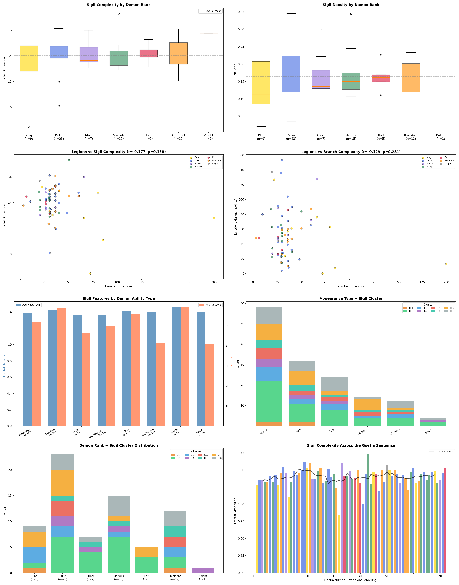

### The Headline Result: Independence

The sigils appear to be **structurally independent of textual content**. Specifically:

- **Rank vs complexity**: Kruskal-Wallis test gives p=0.89 — Kings, Dukes, Princes, Marquises, Earls, and Presidents all have statistically indistinguishable sigil complexity. A King's seal is no more elaborate than a President's.

- **Legions vs complexity**: Pearson r=-0.13, p=0.28 — there is no correlation between the number of legions a demon commands (a proxy for "power") and the structural complexity of its seal. Paimon with 200 legions doesn't have a more complex sigil than Ose with 3.

- **Rank vs cluster assignment**: Chi-squared p=0.57 — demon rank is statistically independent of which structural family the sigil belongs to. Kings are scattered across clusters just as randomly as Dukes.

- **Goetia ordering vs complexity**: Spearman rho=0.013, p=0.91 — no trend whatsoever. The sigils don't get more or less complex as you move through the traditional 1-72 sequence.

### What's Interesting Despite the Independence

While the overall tests show no statistically significant relationships, the **ability category profiles** reveal suggestive patterns:

| Category | n | Avg FD | Avg Junctions | Avg Holes |
|---|---|---|---|---|
| **Love** | 11 | 1.413 | 78.5 | 4.5 |
| **Familiar** | 11 | 1.424 | 59.4 | 3.0 |
| **Knowledge** | 25 | 1.381 | 51.4 | 2.2 |
| **Military** | 8 | 1.310 | 38.5 | 1.8 |
| **Destruction** | 11 | 1.335 | 39.9 | 1.8 |

Demons associated with **love** have the highest average junction count (78.5) and most holes (4.5) — the most "circuit-like" sigils. Demons associated with **military** and **destruction** have the simplest sigils (lowest FD, fewest junctions). Whether this is meaningful or an artifact of small sample sizes is an open question worth pursuing with more rigorous controlled testing.

### The Lone Knight

Furcas, the only Knight-ranked demon, is a statistical outlier — his sigil has a fractal dimension of 1.55, 137 junctions, and 12 holes, making it far more complex than any rank average. Since n=1, this tells us nothing about "Knights" as a class, but Furcas's seal is genuinely one of the most circuit-like in the entire collection.

### Implications

The independence of text and image strongly suggests that **the sigils were not designed to encode textual information**. They weren't made more complex for more powerful demons, or varied in style by rank. This is consistent with the hypothesis that the sigils derive from a separate visual tradition — possibly constructed through a mechanical process (like overlaying letter forms on a planetary kamea/magic square) rather than being illustrative representations of the demons' described attributes.

## Requirements

```
opencv-python-headless
numpy
scipy
scikit-image
scikit-learn
matplotlib
networkx
```

## Usage

Place the source image as `../1280px-72_Goeta_sigils.png` (or edit the `INPUT` path in script 1), then run sequentially:

```bash
python 01_segment_sigils.py
python 02_skeleton_analysis.py
python 03_junction_endpoint_detection.py
python 04_hough_geometry.py
python 05_feature_extraction.py
python 06_clustering.py
python 07_cluster_composites.py
python 08_textual_correlation.py
```

Each script produces JSON data files and PNG visualizations in subdirectories.

## Future Directions

- **Graph-theoretic comparison** — convert each skeleton to a proper graph (nodes=junctions, edges=strokes) and compare using graph edit distance or spectral methods
- **Generative model** — learn a probabilistic grammar that can synthesize new "valid" sigils
- **Historical correlation** — compare sigil complexity features against the ordering in different grimoire manuscripts to detect editorial patterns
- **Fourier descriptors** — encode contour shapes for rotation-invariant similarity
- **Template matching** — detect recurring sub-motifs shared across multiple sigils
